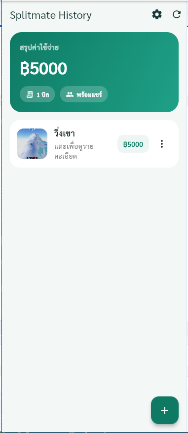
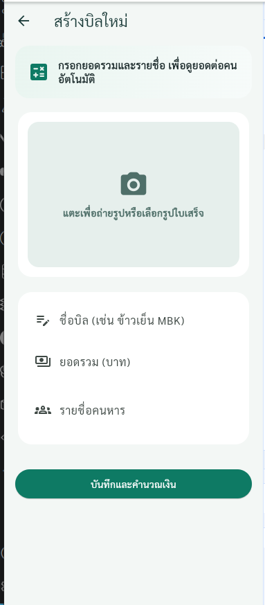
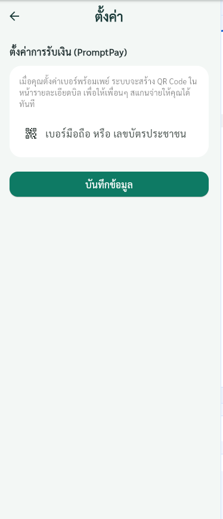

# Splitmate

แอป Flutter สำหรับหารบิลกับเพื่อนแบบง่ายๆ รองรับการสร้างบิลจากใบเสร็จ, คำนวณยอดต่อคน, เก็บประวัติบิล และแสดง QR สำหรับจ่ายผ่าน PromptPay

## ฟีเจอร์หลัก

- สร้างบิลใหม่พร้อมรูปใบเสร็จ
- แก้ไขบิลและลบบิลได้จากหน้าแรก (เมนูต่อรายการบิล)
- คำนวณยอดหารต่อคนอัตโนมัติจากรายชื่อผู้ร่วมจ่าย
- แสดงประวัติบิลทั้งหมดจาก Supabase
- ดูรายละเอียดบิลและยอดของแต่ละคน
- ตั้งค่าเบอร์ PromptPay เพื่อสร้าง QR Code ในหน้ารายละเอียดบิล

## ภาพหน้าจอ (แคปแล้ววางไฟล์ได้เลย)

ให้วางไฟล์รูปไว้ในโฟลเดอร์ `docs/screenshots/` ตามชื่อด้านล่าง

- `docs/screenshots/splash.png`
- `docs/screenshots/home.png`
- `docs/screenshots/create-bill.png`
- `docs/screenshots/bill-detail.png`
- `docs/screenshots/setting.png`

จากนั้น README นี้จะแสดงภาพอัตโนมัติ:

### Splash


### Home


### Create Bill


### Bill Detail


### Settings


## Tech Stack

- Flutter
- Supabase (`supabase_flutter`)
- `image_picker`
- `shared_preferences`
- `qr_flutter`

## การตั้งค่า Supabase

1. เปิดโปรเจกต์ Supabase ของคุณ
2. ไปที่ SQL Editor
3. เปิดไฟล์ migration นี้ แล้วรันทั้งหมด:

- `supabase/migrations/20260424_splitmate_public_schema.sql`

สิ่งที่จะถูกสร้างจากสคริปต์:

- ตาราง `public.bills`
- ตาราง `public.participants`
- RLS policy สำหรับใช้งานแบบ public access
- Storage bucket ชื่อ `receipts` และ policy ที่เกี่ยวข้อง

4. ตรวจสอบค่า `url` และ `anonKey` ในไฟล์ `lib/main.dart` ให้ตรงกับโปรเจกต์ของคุณ

## วิธีรันแอป

```bash
flutter pub get
flutter run
```

## โครงสร้างข้อมูลโดยย่อ

- `bills`: เก็บชื่อบิล, ยอดรวม, รูปใบเสร็จ, วันที่สร้าง
- `participants`: เก็บรายชื่อคนในแต่ละบิล และยอดที่ต้องจ่าย

## หมายเหตุ

- หากรูปภาพออนไลน์บางรูปโหลดไม่ได้ (เช่นลิงก์หมดอายุหรือ 404) แอปมี fallback UI ให้ใช้งานต่อได้
